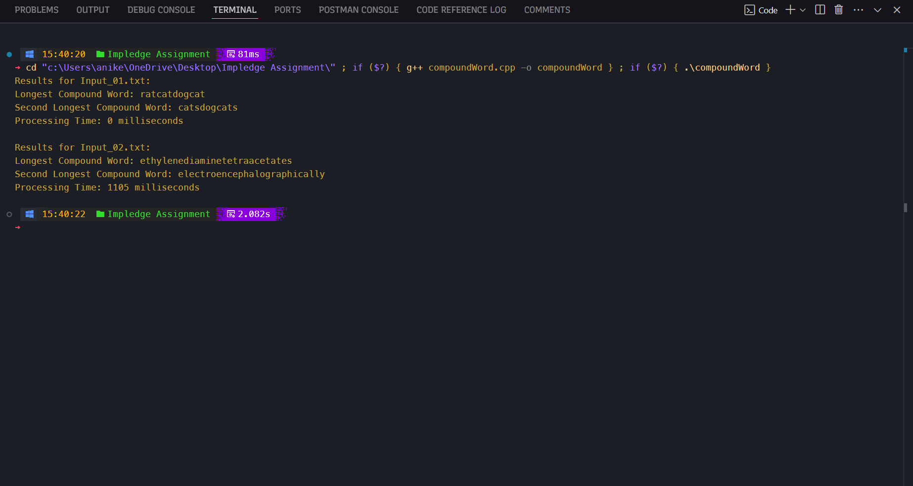

# Compound Word Finder

## Overview
The **Compound Word Finder** program identifies the longest and second longest compound words from a list of words provided in a text file. A compound word is defined as a word that can be constructed by concatenating shorter words from the same list. The program reads the input file, processes the words, and outputs the results along with the time taken to process the file.

## Design Decisions and Approach

### Data Structures
- **unordered_set**: Used to store the words for O(1) average time complexity for lookups.
- **unordered_set**: Used to cache confirmed compound words and non-compound words to avoid redundant computations.

### Algorithm
- **isCompoundWord**: A recursive function with memoization to check if a word can be formed by concatenating other words in the set.
- **processWordList**: Reads the input file, identifies compound words, and determines the longest and second longest compound words.

### Optimization
- **Memoization**: Caches results of subproblems to avoid redundant computations.
- **Efficient Sorting**: Words are processed in descending order of length to prioritize longer words first.

## Steps to Execute the Code

### Prerequisites
- Ensure you have a C++ compiler installed (e.g., g++, clang++).
- Place the input files (`Input_01.txt` and `Input_02.txt`) in the same directory as the source code.

### Compile the Code
Open a terminal and navigate to the directory containing the `compoundWord.cpp` file. Run the following command to compile the code:

```bash
g++ compoundWord.cpp -o CompoundWord
 ```
## Run the Program
Execute the compiled program with the following command:

```
./CompoundWord
```

## Output

The program will read the input files, process the words, and display the results in the terminal. The output will include the longest and second longest compound words along with the time taken to process each file.

Example Output


